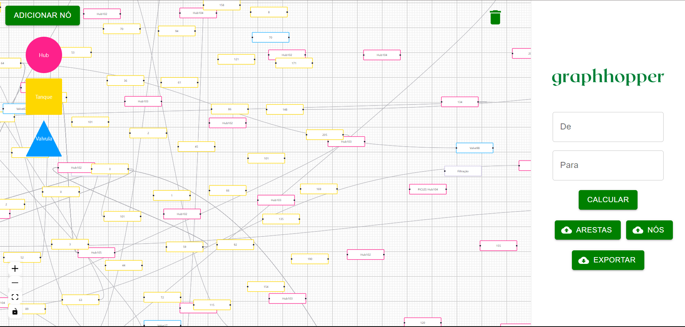

---

title: Modelo para o artigo do Módulo 5
author: Alunos do Módulo 5 - Inteli
date: Agosto de 2023
abstract: Como parte das atividades do módulo 5, cada grupo deverá redigir um texto descrevendo os resultados do projeto no formato de um artigo científico. Este arquivo no formato markdown contém a estrutura básica deste artigo. Cada grupo deverá editar este arquivo com a descrição do projeto que desenvolveu.

---

# Introdução

A otimização das rotas de transferência entre as etapas de produção é um desafio crítico enfrentado pela indústria de automação. A eficiência operacional é fundamental para garantir a produção de cerveja de alta qualidade enquanto se minimiza o tempo de produção e se utiliza os recursos disponíveis de maneira otimizada.

A produção de cerveja é uma combinação complexa de processos que envolvem múltiplas etapas, desde a fermentação até a maturação. A eficácia na gestão das rotas de transferência entre essas etapas não apenas influencia diretamente a qualidade do produto final, mas também impacta os custos, a produtividade e a capacidade de resposta da cervejaria ao mercado. (AROH, 2019). O problema consiste em encontrar o caminho mais eficiente entre os pontos de transferência, considerando a disposição dos tanques, válvulas e conexões,ou seja, busca-se uma otimização da rota de transferência.

Um(a) engenheiro(a) de automação responsável pela otimização destas rotas precisará programar suas rotas no sistema, sendo o método mais comum fazer o controle pelo CLP (Controlador Lógico Programável), contudo, otimizar as rotas do ciclo de produção da cerveja visualizando as conexões, válvulas e tanques apenas no P&ID pode ser uma tarefa demorada e transmitir a informação das conexões a serem usadas é um trabalho manual árduo.

Com estes problemas em mente, uma das ferramentas mais usadas para a representação de conexões e pontos (nós) é a representação em grafos, utilizada desde projeção de rotas de avião até representar as conexões de neurônios em uma rede neural. Essa abordagem não só simplifica a compreensão das complexas interações entre os componentes do sistema, mas também permite uma abordagem mais estratégica para a tomada de decisões. (MIN, 2023).

Assim, este trabalho propõe uma solução inovadora e abrangente para a otimização das rotas de transferência na produção de cerveja, empregando a modelagem em grafos como base para a tomada de decisões. Ao considerar informações detalhadas sobre a disposição dos tanques, válvulas e conexões, juntamente com regras de origem e destino, o trabalho busca criar uma ferramenta que consiga determinar o caminho mais eficiente entre dois pontos e fornecer ao usuário final as válvulas que devem estar energizadas para percorrê-lo.

A abordagem proposta permitirá a maximização da utilização dos recursos disponíveis, a minimização do tempo de transferência entre as etapas e a otimização da alocação de cervejas de diferentes lotes nos tanques.

## Motivações

A origem do presente projeto remonta a uma demanda específica proveniente da renomada empresa Rockwell, uma das principais referências no setor de automação industrial. A problemática enfrentada pela indústria, e que serviu de gatilho para esta pesquisa, reside na automatização das rotas utilizadas entre as fases cruciais de fermentação e maturação em cervejarias. Atualmente, as soluções disponíveis são notavelmente inflexíveis, exigindo um esforço considerável de programação a cada nova configuração de tubulações e tanques. Como exemplo prático, uma adega em uma cervejaria pode necessitar de até 200 rotas distintas para transferir cervejas fermentadas para tanques de maturação. Este cenário se torna ainda mais complexo em uma adega composta por 30 tanques, dos quais 10 são dedicados à fermentação e 20 à maturação.

O objetivo central deste projeto é formular uma solução que seja tanto modular quanto flexível, permitindo a definição de rotas otimizadas através da aplicação de modelagem em grafos. Com isso, busca-se superar a limitação das abordagens atuais e proporcionar uma ferramenta capaz de adaptar-se às diversas configurações e necessidades encontradas na indústria.

A complexidade inerente a esse desafio tecnológico repercute em implicações econômicas substanciais. A falta de otimização nas rotas pode acarretar em custos não previstos e, eventualmente, na deterioração da qualidade do produto final. Erros ou ineficiências em qualquer fase do roteamento podem resultar em atrasos e desperdícios de recursos, afetando adversamente o 'lead time' de produção e a capacidade de atender a demandas de mercado em constante mutação.

A relevância deste projeto transcende a indústria cervejeira, estendendo-se a um amplo espectro de indústrias de processamento que enfrentam desafios similares. A otimização das rotas não somente influencia a produção, mas também impacta toda a cadeia de valor, desde a aquisição de insumos até a distribuição dos produtos finais. Ao negligenciar a necessidade de um sistema de roteamento eficiente, há um risco iminente à competitividade da empresa em um mercado global e altamente competitivo.

Portanto, é imperativo abordar essa questão de forma proativa, não apenas como uma necessidade operacional, mas também como uma estratégia vital para a sustentabilidade e crescimento a longo prazo da empresa. A implementação de um sistema de roteamento eficaz é um investimento que visa evitar custos ocultos, garantir a máxima qualidade e proporcionar a flexibilidade necessária para adaptar-se rapidamente às exigências do mercado em constante evolução.

## Metodologia

A metodologia de pesquisa e prototipação utilizada no desenvolvimento da solução presente neste trabalho tem como base a exploração de soluções existentes no mercado, pesquisas bibliográficas, conversas com o professor orientador do projeto e consultas em ferramentas online.

Em uma primeira etapa, a equipe criou manualmente uma representação gráfica da solução com o objetivo de simplificar a compreensão do arquivo fornecido, modelando a planta fornecida com algumas simplificações (substituição de um conjunto modular de vávulas por um nó do tipo "Hub"), priorizando o fácil entendimento. Após a validação por parte do cliente, esse esboço tornou-se um guia para as decisões tomadas pela equipe. Posteriormente, o grupo considerou a criação de um algoritmo para gerar automaticamente o modelo com base no arquivo da planta, porém, após extensa pesquisa, concluiu-se que essa ideia estava além do escopo do projeto. Portanto, a equipe optou por desenvolver uma representação matemática da solução proposta e começou a trabalhar no backend, criando programas para efetuar as alterações no modelo por meio de solicitações diretas e documentando os testes realizados.

Para representar a planta fornecida de forma matemática, foi adotado um modelo de grafo bidirecional, no qual os nós representam os tanques e válvulas, e as arestas indicam as conexões entre eles. A partir dessa representação de modelagem, foi possível extrair uma matriz de adjacência, fundamental para a aplicação de algoritmos de caminho mínimo. Essa abordagem matemática proporcionou uma base sólida para as análises subsequentes, permitindo a otimização dos fluxos e a identificação dos caminhos mais eficientes dentro do sistema.

Na sequência, o grupo determinou quais dados seriam utilizados como entrada (o desenho realizado na aplicação web) e quais seriam os dados de saída (uma sequência de nós nos caminhos solicitados e uma planilha com o estado das válvulas em cada caminho possível). Paralelamente, iniciou-se o desenvolvimento do frontend da solução, com ênfase na interatividade e na facilidade de compreensão, mantendo a possibilidade de simplificação do diagrama com a opção de criar o nó Hub. 

No que diz respeito ao frontend da solução, o grupo se concentrou em torná-lo altamente interativo e de fácil compreensão. Para essa parte do projeto, eles consultaram as documentações de várias tecnologias, incluindo:

Vite: Um servidor de desenvolvimento local, frequentemente utilizado em conjunto com o React, para acelerar o desenvolvimento e fornecer uma experiência de desenvolvimento eficiente.

React Flow: Uma biblioteca JavaScript que auxilia na criação de fluxos de dados e visualização de elementos em forma de grafo, o que provavelmente era relevante para representar os caminhos solicitados de forma gráfica.

Material UI: Um componente da biblioteca React que simplifica a criação da interface do usuário, tornando-a mais atraente e consistente em termos de design.

Quanto ao backend, o grupo optou por utilizar as seguintes tecnologias:

Java: A linguagem de programação principal usada no projeto, que é conhecida por sua robustez e ampla adoção na indústria de desenvolvimento de software.

Spring Boot: Um framework que simplifica o desenvolvimento de aplicativos Java, oferecendo recursos como injeção de dependência e configuração automática.

Neo4J: Uma ferramenta para criação de grafos e banco de dados, que provavelmente foi utilizada para armazenar e consultar os dados relacionados aos caminhos e válvulas.

Além disso, o grupo utilizou a aplicação Insomnia para testar e validar os endpoints criados no backend. O Insomnia é uma ferramenta que permite enviar requisições programáveis para servidores, facilitando o processo de depuração e verificação do funcionamento correto do sistema.

# Pesquisa sobre o assunto

Para fundamentar a abordagem deste trabalho, foi realizada uma pesquisa extensiva sobre o assunto, buscando informações baseadas em fontes científicas, incluindo livros e artigos científicos. Esta pesquisa ajudou a contextualizar o problema e identificar trabalhos científicos relevantes relacionados a problemas similares. Alguns dos principais achados são os seguintes:

1. **Modelagem em Grafos na Otimização de Processos**: A utilização de grafos na otimização de processos industriais é uma abordagem amplamente reconhecida na literatura científica. Trabalhos como "Graph Theory and Its Applications to Problems of Society" de Bondy e Murty (2008) destacam como os grafos podem ser aplicados em diversas áreas, incluindo a logística e otimização de rotas.

2. **Algoritmos de Roteamento**: A pesquisa sobre algoritmos de roteamento em grafos é fundamental para a compreensão da eficiência das rotas de transferência. O algoritmo de Dijkstra, mencionado neste trabalho, é amplamente discutido em livros como "Introduction to the Design and Analysis of Algorithms" de Levitin (2011).

3. **Indústria Cervejeira e Automação**: A indústria cervejeira tem sido alvo de estudos relacionados à automação e otimização de processos. Trabalhos como "Optimization of Beer Production Processes Using Process Integration Techniques" de Ming (2018) exploram a aplicação de técnicas de otimização na produção de cerveja.

4. **Representação Gráfica de Processos Industriais**: A representação gráfica de processos, similar à utilizada neste trabalho, é uma área de pesquisa importante em engenharia de processos. Livros como "Chemical Process Equipment: Selection and Design" de Couper, Penney e Fair (2010) abordam a importância da representação visual na análise de sistemas complexos.

# Análise da complexidade da solução proposta

Consideraremos os casos de pior e melhor cenário em termos de tempo de execução.

## Pior caso (Big O):

No pior caso, o algoritmo de Dijkstra visita todos os nós no grafo antes de encontrar o caminho mais curto. Isso ocorre quando todas as arestas têm pesos diferentes e o algoritmo precisa explorar todas as opções para encontrar o caminho mais curto. Portanto, a complexidade de tempo no pior caso é de O(V²), onde V é o número de nós no grafo.

## Melhor caso (Big Omega):

No melhor caso, o algoritmo de Dijkstra encontra o caminho mais curto após explorar apenas algumas arestas. Isso acontece quando o nó de destino é um dos vizinhos diretos do nó de origem. Portanto, a complexidade de tempo no melhor caso é de $\Omega(1)$, pois o algoritmo pode parar após uma única iteração.

O nosso algoritmo sempre faz a busca completa, então ele é sempre O(V²).

## Complexidade média (Theta):

A complexidade média do algoritmo de Dijkstra depende das características específicas do grafo e das ponderações das arestas. Em média, o algoritmo tem uma complexidade de tempo de $\Theta(V^2)$ em grafos densos e $\Theta(|E| + |V| \log |V|)$ em grafos esparsos, onde $|E|$ é o número de arestas no grafo.

# Análise da corretude da solução proposta

Aplicaremos o método de indução ao invariante do laço identificado anteriormente. O invariante do laço é uma propriedade que deve ser verdadeira antes e após cada iteração do algoritmo.

O invariante do laço identificado no algoritmo de Dijkstra é a seguinte propriedade: "Após cada iteração do laço, a distância mais curta conhecida de um nó inicial $s$ para cada nó $v$ no conjunto $S$ é armazenada em $d[v]$."

Vamos realizar a prova da corretude por indução:

**Base da indução:** Antes da primeira iteração do laço, $S$ está vazio e $d[v]$ é infinito para todos os nós $v$ em $V$, exceto $d[s]$, que é definido como 0. Portanto, o invariante do laço é verdadeiro antes da primeira iteração.

**Hipótese de indução:** Suponha que, após $k$ iterações do laço, o invariante do laço seja verdadeiro, ou seja, a distância mais curta conhecida de $s$ para cada nó $v$ em $S$ está armazenada em $d[v]$.

**Passo da indução:** Vamos mostrar que, após a $k+1$-ésima iteração do laço, o invariante do laço ainda é verdadeiro. Na $k+1$-ésima iteração, escolhemos um nó $u$ fora de $S$ com a menor distância conhecida $d[u]$. Adicionamos $u$ a $S$, e para cada nó $v$ adjacente a $u$ em $V$ que ainda não está em $S$, atualizamos a distância $d[v]$ se $d[u] + w(u, v)$ for menor que $d[v]$, onde $w(u, v)$ é o peso da aresta entre $u$ e $v$.

Queremos mostrar que, após essa iteração, o invariante do laço permanece verdadeiro. Para isso, consideremos um nó $v$ que foi adicionado a $S$ nessa iteração. A distância mais curta conhecida de $s$ para $v$ agora está armazenada em $d[v]$, pois a atualizamos apenas se a nova distância fosse menor do que a anterior. Para os nós que já estavam em $S$, sua distância mais curta conhecida não foi alterada nesta iteração, portanto, o invariante do laço ainda é válido para eles.

Portanto, após a $k+1$-ésima iteração, o invariante do laço permanece verdadeiro. Isso conclui a prova da corretude do algoritmo de Dijkstra por indução.

# Resultados obtidos

Uma parte importante para o desenvolvimento da solução são os resultados obtidos pelo grupo, os quais podem ser analisados em diferentes pontos, como: a modelagem final, o algoritmo utilizado e o deployment da solução em uma aplicação web.

## Modelo final

A modelagem final consiste na divisão entre três tipos de nós (tanque, válvula e hub) que são tratados individualmente durante o processamento, assim, o modelo utilizado visa simplificar graficamente a distribuição dos tanques e válvulas, porém, possuindo um alto grau de liberdade para a prototipação e testes.

Esse modelo é projetado para simplificar visualmente a disposição de tanques e válvulas, permitindo uma análise mais clara e eficaz. Utilizamos a representação gráfica dos tanques, válvulas e hubs (conjunto de válvulas) para criar uma representação em grafos, o que facilita a visualização das conexões e pontos cruciais no processo de produção de cerveja.

Este modelo possui três tipos de nós: tanque, válvula e hub, que são tratados individualmente durante o processamento. É importante destacar que optamos por simplificar os hubs de válvulas presentes no P&ID, representando-os com um único nó. Essa escolha foi feita porque estamos priorizando o fluxo de entrada e saída, ao invés dos detalhes internos do hub.

## Algoritmo Utilizado

Outro aspecto crucial deste trabalho é o algoritmo de Dijkstra que utilizamos para calcular as rotas mais curtas. Dado que não dispomos de dados de distância ou outros pesos para as arestas, nossa abordagem se baseia na minimização do número de nós visitados entre o ponto de partida e o destino.

O algoritmo de Dijkstra é amplamente reconhecido por encontrar o caminho mais curto em um grafo com base em pesos associados às arestas, e nesse caso, adaptamos sua aplicação para encontrar o caminho mais eficiente entre dois pontos em nosso modelo de grafos.

Em nosso contexto de rotas de transferência de cerveja, adaptamos o algoritmo para minimizar o número de nós visitados. Ele leva em conta os hubs simplificados para determinar a rota mais eficiente, priorizando o fluxo de entrada e saída. Essa abordagem garante que o algoritmo leve em conta não apenas a eficiência das conexões diretas entre os pontos, mas também a otimização das válvulas nos hubs, contribuindo para a redução do tempo de transferência e a maximização da eficiência operacional na produção de cerveja.

### Algoritmo de Dijkstra

O algoritmo de Dijkstra é utilizado para encontrar o caminho mais curto entre um nó inicial $s$ e todos os outros nós em um grafo ponderado $G = (V, E)$, onde $V$ é o conjunto de nós e $E$ é o conjunto de arestas. O algoritmo calcula o caminho mais curto $d[v]$ de $s$ para cada nó $v$ em $V$.

**Inicialização:**
- Inicialize $d[v]$ para todos os nós $v$ em $V$ como infinito.
- Defina $d[s] = 0$.
- Inicialize um conjunto $S$ vazio para armazenar os nós cujos caminhos mais curtos a partir de $s$ já foram encontrados.

**Iteração:**
- Enquanto houver nós fora de $S$, faça:
  - Escolha um nó $u$ fora de $S$ com a menor distância conhecida $d[u]$.
  - Adicione $u$ a $S$.
  - Para cada nó $v$ adjacente a $u$ em $V$ que ainda não está em $S$, faça:
    - Atualize a distância $d[v]$ se $d[u] + w(u, v)$ for menor que $d[v]$, onde $w(u, v)$ é o peso da aresta entre $u$ e $v$.

Ao final do algoritmo, você terá as distâncias mais curtas $d[v]$ para todos os nós $v$ a partir do nó inicial $s$, permitindo determinar as rotas mais eficientes em termos de número de nós visitados.

A seguir, temos uma representação em pseudocódigo da adaptação do Dijkstra utilizada no projeto:

```
djikstra (matriz de inteiros m, inteiro positivo noIni, inteiro positivo noFin)

  Variáveis locais: nNos, visit, dist, noPar, i, minVal, minInd, a, u, caminho, noTemp

  nNos = número de colunas de m
  visit = [F, ... ,F] (tamanho: nNos, F: falso, V: verdadeiro)
  dist = [$\infty$, ..., $\infty$] (tamanho: nNos)
  noPar = [null, ..., null] (tamanho: nNos)
  dist[noIni] = 0
  i = 0
  
  enquanto i < nNos - 2 faça
    minVal = $\infty$
    minInd = -1
    a = 0
    
    enquanto a < nNos - 1 faça
      se (visit[a] = F) e (dist[a] < minVal), faça
        minVal = dist[a]
        minInd = a
      fim do condicional
      a = a + 1
    fim do enquanto
    
    visit[minInd] = V
    u = 0
    
    enquanto u < nNos - 1 faça
      se (visit[u] = F) e (m[minInd][u] > 0) e (dist[minInd] + m[minInd][u] < dist[u]), faça
        dist[u] = dist[minInd] + m[minInd][u]
        noPar[u] = minInd
      fim do condicional
      u = u + 1
    fim do enquanto
    
    i = i + 1
  fim do enquanto

  caminho = [noFin]
  noTemp = noFin
  
  enquanto noTemp != noIni faça
    noTemp = noPar[noTemp]
    adicionar noTemp no início de caminho
  fim do enquanto
  
  retorne dist[noFin], caminho
fim do djikstra
```

## Deployment da solução em uma aplicação web

Um marco significativo deste projeto foi a implementação bem-sucedida da nossa solução em uma aplicação web interativa. Isso permite que os usuários finais visualizem e utilizem facilmente nossa ferramenta para otimizar as rotas de transferência. A aplicação web oferece uma interface intuitiva que permite aos usuários selecionar pontos de origem e destino e, em seguida, calcula automaticamente a rota mais eficiente. Além disso, a aplicação permite a importação de dados em formato CSV e oferece a opção de exportar os resultados em Excel.

<center>Imagem 1 – Captura de tela do website graphhopper</center>



<center>Fonte: Elaborada pela equipe (2023).</center>

# Conclusão

Com base nos objetivos delineados e nos resultados obtidos ao longo deste trabalho, é possível tirar algumas conclusões significativas que destacam a importância e a promissora eficácia da abordagem proposta para a otimização das rotas de transferência na produção de cerveja.

Primeiramente, a modelagem em grafos se mostrou uma ferramenta poderosa para simplificar a compreensão das complexas interações entre os componentes do sistema de produção de cerveja. Ao dividir o processo em nós representando tanques, válvulas e hubs, conseguimos criar uma representação visual intuitiva que facilita a análise e a tomada de decisões estratégicas. No entanto, é importante notar que essa simplificação, especialmente na representação dos hubs de válvulas, foi uma escolha deliberada para priorizar a eficiência do fluxo de entrada e saída.

O uso do algoritmo de Dijkstra, adaptado para minimizar o número de nós visitados entre os pontos de origem e destino, se mostrou eficaz na determinação das rotas mais eficientes. Isso contribuiu para a redução do tempo de transferência entre as etapas da produção, resultando em benefícios em termos de eficiência operacional.

Além disso, a implementação bem-sucedida da solução em uma aplicação web interativa, tornando a ferramenta acessível aos usuários finais.

### Sugestões para Trabalhos Futuros

Com base nas descobertas e no progresso alcançado neste trabalho, sugerimos algumas direções para pesquisas futuras que podem aprofundar e expandir ainda mais essa abordagem:

1. **Refinamento do Modelo de Grafos**: Investir em pesquisas adicionais para aprimorar o modelo de grafos, levando em consideração fatores específicos da indústria de cerveja, como características de fermentação e maturação. Isso pode melhorar ainda mais a precisão das rotas otimizadas.

2. **Integração com Tecnologias Emergentes**: Explorar a integração dessa abordagem com tecnologias emergentes, como Internet das Coisas (IoT) e análise de dados em tempo real, para permitir uma otimização adaptativa e contínua das rotas.

3. **Validação Empírica**: Realizar estudos de caso e validações empíricas em cervejarias reais para demonstrar a eficácia da abordagem em cenários do mundo real.

Em resumo, este trabalho representa um passo importante em direção à resolução de um desafio crítico na indústria de automação e cervejaria. Esperamos que as sugestões acima inspirem futuros esforços de pesquisa e desenvolvimento, contribuindo para uma maior eficiência operacional e competitividade nas indústrias afetadas.

# Referências Bibliográficas

AROH, K. **Beer production**. 2019. 15p. Universidade Federal de Tecnologia de Owerri, Owerri, Imo State, Nigeria, 2019.

BONDY, A. J.; MURTY R. S. U. **Graph Theory and Its Applications to Problems of Society**. Nova York, EUA: Editora Springer, 2008. 663p.

CORMEN, T. H., LEISERSON, C. E., RIVEST, R. L., & STEIN, C. **Introduction to Algorithms**. 3rd ed. MIT Press, 2009.

COUPER, R. J.; PENNEY R. W.; Fair R. J. **Chemical Process Equipment: Selection and Design**. 3. ed. Oxônia, Inglaterra, Reino Unido: Editora Butterworth-Heinemann, 2012. 864 p.

GONÇALVES, L. F. M.. **Desenvolvimento de uma Interface de Comunicação para Representação em Grafos de Sistemas Automatizados**. 2018. Trabalho de Conclusão de Curso (TCC). Universidade Tecnológica Federal do Paraná, Curitiba, Paraná, Brazil, 2018.

GUPTA, S. **Neo4j Essentials**. 1. ed. Birmingham, Inglaterra: Editora Packt, 2015. 179 p.

JAVAID, A. **Understanding Dijkstra's Algorithm**. 2013. 27p. Escola Superior de Negócios (WSB) em Dąbrowa Górnicza, Dąbrowa Górnicza, Silésia, Polônia, 2013.

LAFORE R. **Data Structures and Algorithms in Java**. 2. ed. Carmel, Indiana, EUA: Editora Sams, 2002. 800p.

LEVITIN, A. **Introduction to the Design and Analysis of Algorithms**. 3. ed. Londres, Inglaterra: Editora Pearson, 2011. 600p.

MIN, W.; LIU, C.; XU, L.; JIANG, S. **Applications of knowledge graphs for food science and industry**. China, Beijing: Editora CellPress. 2023.

MING, M.; **Optimization of Beer Production Processes Using Process Integration Techniques** 2018. Chinese Academy of Sciences, Xicheng District, Beijing, China. 2018.

SILBERSCHATZ, A.; KORTH, H. F.; SUDARSHAN, S.. **Database system concepts**. 2011. Universidade Jaypee de Tecnologia da Informação, Waknaghat, Solan, Himachal Pradesh, India, 2011.