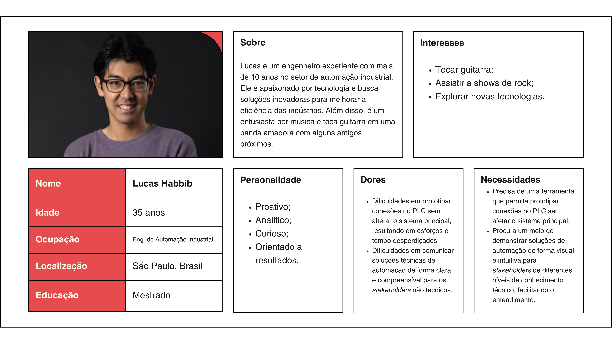
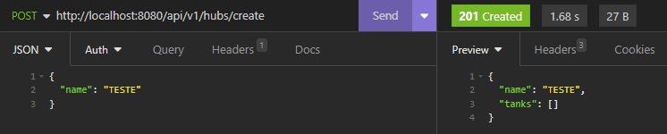
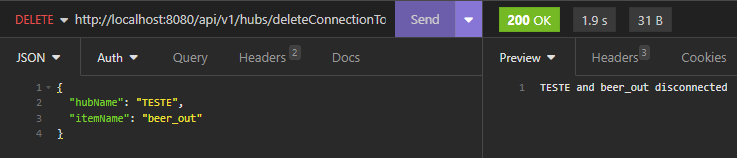

<table>
<tr>
<td>
<a href= "https://www.rockwellautomation.com/pt-br.html"></a>
<td>
<a href= "https://www.inteli.edu.br/"></a>
</td>
</tr>
</table>

<font size="+12"><center>
Roots
</center></font>

**Conteúdo**

1. [Entendimento do Contexto do Problema](#1-entendimento-do-contexto-do-problema)<br>
   1.1. [Dados disponíveis](#11-dados-disponíveis)<br>
   1.2. [Objetivo](#12-objetivo)<br>
   1.3. [Variáveis de decisão](#13-variáveis-de-decisão)<br>
   1.4. [Limitações do Problema](#14-limitações-do-problema)<br>
   1.5. [Representação Visual no Neo4J](#15-representação-visual-no-neo4j)<br>
   1.6. [Indicação de Cenários Factíveis](#16-indicação-de-cenários-factíveis)<br>
2. [Entendimento da Experiência do Usuário](#2-entendimento-da-experiência-do-usuário)<br>
   2.1. [Personas](#21-persona)<br>
   2.2. [User Stories](#22-user-stories)<br>
3. [Entendimento do Negócio](#3-entendimento-do-negócio)<br>
   3.1. [Contexto da indústria do parceiro (principais competidores, modelos de negócio, tendências de mercado) + 5 forças](#31-contexto-da-indústria-do-parceiro-principais-competidores-modelos-de-negócio-tendências-de-mercado-5-forças)<br>
   3.2. [Análise SWOT do parceiro](#32-análise-swot-do-parceiro)<br>
   3.3. [Descrição da solução a ser desenvolvida](#33-descrição-da-solução-a-ser-desenvolvida)<br>
   3.4. [Value Proposition Canvas do produto](#34-value-proposition-canvas-do-produto)<br>
   3.5. [Matriz de riscos](#35-matriz-de-riscos)<br>
4. [Backend](#4-backend)<br>
   4.1. [Testes HUB](#41-testes-hub)<br>
   4.2. [Testes Entradas e Saidas](#42-testes-entradas-e-saidas)<br>
   4.3. [Testes Tanques](#43-testes-tanques)<br>
5. [Aplicação integrada](#5-aplicação-integrada)<br>
   5.1 [Testes de criar nós](#51-testes-create-nós)
6. [Análise Preliminar do Algoritmo](#6-análise-preliminar-do-algoritmo)<br>
   6.1. [Big O, Ômega e Theta](#61-big-o-ômega-e-theta)<br>
   6.2. [Demonstração de corretude](#62-demonstração-de-corretude)<br>

# 1. Entendimento do Contexto do Problema

No contexto do problema, a modelagem a partir do diagrama P&ID (Pipe and Instruments Diagram) desempenha um papel crucial. A partir da disposição detalhada dos tanques, válvulas e tubulações, a solução busca criar um sistema otimizado de rotas, considerando as regras de transferência, os tempos de fermentação e maturação, e as capacidades dos tanques. Isso proporciona uma visualização clara das conexões e permite uma prototipação ágil, visando aprimorar a eficiência operacional.

## 1.1. Dados disponíveis

Os dados disponíveis incluem informações sobre a disposição dos tanques, válvulas e hubs na fábrica de cerveja, bem como dados sobre as conexões entre eles. Além disso, as regras que determinam os pontos de origem e destino das transferências de cerveja, bem como os tempos de fermentação e maturação, também estão entre os dados essenciais.

## 1.2. Objetivo

O objetivo central do problema em questão é otimizar as rotas de transferência dentro de um sistema de produção de cerveja, com foco na eficiência operacional. Esse objetivo visa minimizar o número de nós visitados ao longo da rota, otimizando assim o tempo e os recursos envolvidos nas transferências.

## 1.3. Variáveis de decisão

No núcleo deste problema está a decisão de determinar se cada aresta (conexão) entre dois nós deve ser incluída ou não no caminho. A variável $x_{ij}$ será igual a 1 se a aresta entre o nó $i$ e o nó $j$ pertence ao caminho percorrido, e 0 caso contrário:

$$
X_{ij} = \begin{cases} 
0 & \text{se para } i, j \in \text{nós}, X_{ij} \text{ não pertence ao caminho percorrido} \\
1 & \text{se para } i, j \in \text{nós}, X_{ij} \text{ pertence ao caminho percorrido} 
\end{cases}
$$

O objetivo matemático então é:

$$
\text{Min}(F) = \sum \text{ Peso cada conexão} \times X_{ij}
$$

O "Peso cada conexão" mencionado refere-se a uma medida que quantifica a importância ou custo associado a cada conexão entre tanques, válvulas e outros componentes do processo. Esse peso pode representar diversas variáveis, como tempo de transferência, custo energético ou qualquer outro fator relevante para a operação.

## 1.4. Limitações do Problema

Duas limitações fundamentais estão associadas ao problema de otimização de rotas de transferência na produção de cerveja:

1. **Tempo de Espera e Operação**: Uma consideração crucial é o tempo de transmissão da cerveja, ou seja, a distância entre as partes do processo. Que pode ser expressa como:

$$
X_{ij} \in [0,1]
$$

2. **Conexão de nós**: Uma limitação adicional, impor a restrição de que cada nó deve ter exatamente uma aresta de entrada e uma aresta de saída (excluindo os pontos de origem e destino). Que pode ser expressa como:

$$
\sum_{j=1, j\neq i}^{n} x_{ij} = 1, \quad \forall i
$$

## 1.5. Representação Visual no Neo4J


Os nós numerados representam os tanques de fermentação e maturação na cervejaria. Cada um desses nós é identificado por um número único que corresponde a um local específico na planta de produção.

Vale a pena ressaltar que ptamos por fornecer uma representação flexível dos "Hubs" de válvulas presentes no P&ID. Agora, os engenheiros têm a opção de visualizar os Hubs como um único nó para simplificar a visualização ou podem escolher visualizar cada válvula individualmente para obter detalhes mais específicos e tomar decisões na hora de programa-las. Essa mudança foi implementada para atender às diferentes necessidades de detalhamento e priorização, seja focando no fluxo de entrada e saída ou nos detalhes internos do hub.


Essa simplificação pode ser visualizada no diagrama a seguir:


Outro ponto importante é nossa abordagem de modelagem no P&ID incorpora uma inovação significativa quando se trata de monitorar o estado das válvulas a partir de um arquivo CSV. Introduzimos o conceito de válvulas gêmeas "ON" e "OFF". Quando encontramos duas válvulas com nomes idênticos no P&ID, mas uma termina em "ON" e a outra em "OFF", consideramos que essas são válvulas gêmeas e representam, na verdade, uma única válvula no arquivo CSV. Esse design simplifica o processo de atualização e leitura do arquivo. Quando o sistema detecta que um caminho utilizou a válvula "ON", o arquivo CSV indica que a válvula correspondente foi energizada. Se o caminho utiliza a válvula "OFF", o arquivo mostrará que a válvula não foi ativada. Essa metodologia condensa as informações e oferece uma visão mais clara e eficiente do estado operacional das válvulas, tornando o processo de monitoramento mais intuitivo e menos propenso a erros.


## 1.6. Indicação de Cenários Factíveis

Para aplicar a modelagem em grafo e o algoritmo de otimização de rotas, consideraremos pelo menos dois cenários factíveis e viáveis. Cada cenário representa uma configuração específica da planta de produção de cerveja, com seus próprios objetivos quantificados. Abaixo, descrevemos esses cenários:

**Cenário 1 - Otimização de Tempo de Transferência:**

- Objetivo: Minimizar o tempo de transferência entre os tanques de fermentação e maturação.
- Configuração: Uma cervejaria com uma planta de produção que inclui vários tanques e hubs. A prioridade principal é acelerar o processo de produção para atender a demandas de mercado em constante mudança.
- Métrica de Sucesso: Redução percentual no tempo médio de transferência entre os tanques.

**Cenário 2 - Otimização de Custos e Recursos:**

- Objetivo: Minimizar os custos operacionais e o uso de recursos, como energia elétrica.
- Configuração: Uma cervejaria com restrições orçamentárias e preocupações ambientais. Neste cenário, a ênfase recai na otimização dos recursos, incluindo o uso eficiente das válvulas e a minimização do consumo de energia.
- Métrica de Sucesso: Redução percentual nos custos operacionais e na utilização de recursos.

# 2. Entendimento da Experiência do Usuário

## 2.1. Persona




## 2.2. User Stories

**Carla Gaia:**

- "Eu, como engenheira responsável pelo controle da produção da fábrica, quero agilizar o processo de treino novos colaboradores"

- "Eu, como engenheira responsável pelo controle da produção da fábrica, quero uma visualização do caminho completo da produção"

- "Eu, como engenheira responsável pelo controle da produção da fábrica, quero um ambiênte para testar possíveis conexões sem ter que parar o funcionamento da fábrica"

**Lucas Habbib:**

- "Eu, como engenherio da Rockwell Automation responsável pelo projeto de automação, quero poder prototipar conexões sem ter que alterar a planta no AutoCAD"

- "Eu, como engenherio da Rockwell Automation responsável pelo projeto de automação, quero um programa que gere uma visualização de dados com base em inputs padronizados"

- "Eu, como engenherio da Rockwell Automation responsável pelo projeto de automação, quero um meio de demonstrar nossas soluções para o stakeholder de maneira que facilite o entendimento"

# 3. Entendimento de Negócios

## 3.1. Contexto da indústria do parceiro (principais competidores, modelos de negócio, tendências de mercado) + 5 forças

### Rockwell Automation

A **Rockwell Automation** é uma grande referência no cenário global de automação industrial. Esta empresa americana, estabelecida em 1903, é reconhecida por suas soluções inovadoras em automação e tecnologia industrial. Com uma ampla gama de soluções, que inclui controladores programáveis, software de automação e soluções integradas, a Rockwell Automation trabalha com o objetivo de conectar o mundo físico e digital, ajudando as indústrias a operarem de maneira mais eficiente, sustentável e segura. Sua abordagem centrada no cliente e sua constante busca pela inovação a posicionam como uma concorrente formidável no mercado.

### Principais Competidores

- **Siemens AG**: Empresa alemã, a divisão de automação industrial da Siemens é uma das líderes de mercado, fornecendo diferentes soluções para diversas indústrias.
- **Schneider Electric**: Uma das líderes mundiais em gestão de energia e automação, oferecendo soluções em diversos segmentos de mercado.
- **ABB**: Oferece uma combinação de hardware, software e soluções baseadas em serviço para automação, também atua em várias indústrias.
- **Honeywell Process Solutions**: Focada em soluções de automação para indústrias de processo, incluindo petroquímica, mineração e outros.

### Modelo de Negócios

1. **Venda de Hardware**: Os componentes físicos formam a base de qualquer sistema de automação, incluindo Controladores Lógicos Programáveis (PLCs), sensores, atuadores e sistemas de acionamento.
2. **Venda de Software**: Softwares de automação e sistemas de controle distribuído (DCS) são vitais para monitorar e otimizar a produção.
3. **Serviços e Suporte**: Instalação, manutenção, treinamento e consultoria. Serviços necessários para manter os sistemas de automação funcionando.
4. **Soluções Integradas**: Uma abordagem personalizada para atender às necessidades específicas de diferentes indústrias, combinando hardware, software e serviços.

### Tendências de Mercado

- **Indústria 4.0**: Refere-se à digitalização da manufatura e incorpora Internet das Coisas (IoT), big data e computação em nuvem.
- **Cibersegurança**: Com o aumento do número de aparelhos conectados à internet, garantir a segurança de sistemas de automação é mais importante do que nunca.
- **Integração de Inteligência Artificial e Aprendizado de Máquina**: A adoção dessa tecnologia potencializa os sistemas de automação, permitindo uma resposta mais ágil e precisa a desafios complexos.

A análise das 5 forças de Porter fornece insights adicionais sobre a posição competitiva da Rockwell Automation:

#### Ameaça de produtos substitutos:
Alta. Com o advento e popularização das indústrias 4.0 e 5.0, é provável que as novas indústrias que estão surgindo, já desenvolvam sua cadeia produtiva focada diretamente em maximizar a automatização e eficiência de sua produção. Além disso, tais empresas que acompanham a onda das indústrias 4.0 e 5.0 possuim uma grande implementação de inteligência artificial (IA) e análise de dados em seus processos o que diminui ainda mais a necessidade de uma consultoria de automação.
#### Ameaça de entrada de novos concorrentes:
Baixa. Pois, apesar da expansão do mercado de automação e dos altos investimentos nesse setor, as barreiras de entrada são altas. Para que seja possível entrar nesse mercado é necessário um alto custo com capital intelectual, além disso faz-se necessário a atuação em diferentes regiões, tendo em vista que não só no Brasil, mas na grande maioria dos países as indústrias estão distríbuidas (não uniformemente) pelo país.
#### Poder de negociação dos clientes:
Médio. Ainda que existam outras grandes empresas (Siemens AG, ABB Group, Schneider Electric, Honeywell Process Solutions) que atuam nesse setor o número de clientes que necessitam desse serviço é muito grande, principalmente em países subdesenvolvidos como o Brasil e muitos dos outros 80 países em que a Rockwell está presente. Sendo assim, o poder de negociação dos clientes não é tão alto, tendo em vista o número de potenciais clientes, qualidade (nível das soluções desenvolvidas bem como a velocidade de entrega) oferecida incomum  no mercado e o número de empresas de automação industrial situadas no Brasil.
#### Poder de negociação dos fornecedores:
Alto. Boa parte do insumos requiridos pela Rockwell são dos setores de tecnologia, como componentes eletrônicos, softwares, hardwares de automação industrial e em alguns casos peças específicas necessários para fornecer um produto para determinada empresa. Devido a essas condições o poder de negociação dos fornecedores é alto, haja vista que cada vez mais clientes buscam esses produtos.
#### Rivalidade entre os concorrentes:
Alta. Não apenas no Brasil, mas no mundo existem muitos players (Siemens AG, ABB Group, Schneider Electric, Honeywell Process Solutions, WEG, Yokogawa América do Sul) no mercado de automação industrial, ainda que existam muitos clientes, a quantidade de grandes empresas faz com que a rivalidade entre os concorrentes seja alta.

## 3.2. Análise SWOT do parceiro:


## 3.3. Descrição da solução a ser desenvolvida:

O projeto visa resolver a complexidade na visualização e otimização das conexões de tubulações e tanques controlados por PLC em ambientes industriais.

A solução proposta é um executável que utiliza algoritmos em grafos para permitir aos engenheiros uma visualização clara das conexões. Isso inclui determinar conexões viáveis entre tanques, gerar listas de conexões específicas e representar visualmente essas conexões em um formato de grafo.

Engenheiros de manutenção do PLC utilizarão a aplicação, fornecendo informações sobre componentes e conexões.

Os benefícios incluem uma melhor compreensão das conexões, acelerando a identificação de problemas, a otimização de conexões viáveis e aumento da eficiência operacional. A representação visual em formato de grafo melhora a comunicação.

Os critérios de sucesso são a velocidade de compreensão da visualização e a diminuição do tempo de resposta para identificar problemas. A avaliação será realizada através de testes com engenheiros, medindo o tempo necessário para compreender configurações usando a aplicação e comparando os tempos de identificação e resolução de problemas antes e depois da implementação.

## 3.4. Value Proposition Canvas do produto:


## 3.5. Matriz de riscos:


# 4. Backend

## 4.1. Testes HUB

### Ler


### Criar



### Encontar por nome


### Criar conexões


### Tratamento de erros


### Deletar conexões





### Delete


## 4.2. Testes Entradas e Saidas

### Ler

### Criar

### Conexões


### Deletar


## 4.3. Testes Tanques

### Ler

### Criar

### Conexões


### Deletar


## 4.4 Testes Valves

### Ler

### Criar

### Conexões


# 5. Aplicação integrada
Note que nos testes abaixo são apresentados o console do navegador e os prints comprovando a integração da aplicação, ao observar o código o leitor perceberá que esses prints serão feitos apenas quando realmente forem criado e deletados

## 5.1. Testes Create dos Nós

Após a integração da criação no frontend com o backend os testes foram realizados com sucesso:


## 5.2. Testes Delete dos Nós


## 5.3. Testes Create arestas


## 5.4. Testes Get arestas


Ao atualizar novamente o navegador a aresta criada anteriormente permanece no frontend, isso comprova o funcionamento do get de arestas

## 5.5. Testes Get nós


# 6. Análise Preliminar do Algoritmo

O algoritmo de Dijkstra é usado para encontrar o caminho mais curto de um nó de origem para todos os outros nós em um grafo ponderado (direcionado ou não direcionado). Aqui estão os passos principais do algoritmo:

1. Inicialize uma lista de distâncias mínimas com um valor infinito para todos os nós, exceto o nó de origem, que tem uma distância mínima de 0.
2. Marque todos os nós como não visitados.
3. Escolha o nó não visitado com a menor distância mínima conhecida.
4. Para cada vizinho não visitado desse nó, calcule a distância mínima total até esse vizinho através do nó atual. Se essa distância for menor do que a distância mínima conhecida para o vizinho, atualize-a.
5. Marque o nó atual como visitado.
6. Repita os passos 3 a 5 até que todos os nós tenham sido visitados ou a menor distância para o nó de destino seja infinita (indicando que não há caminho).

A seguir, temos uma representação em pseudocódigo da adaptação do Dijkstra utilizada no projeto:

```
djikstra (matriz de inteiros m, inteiro positivo noIni, inteiro positivo noFin)

  Variáveis locais: nNos, visit, dist, noPar, i, minVal, minInd, a, u, caminho, noTemp

  nNos = número de colunas de m
  visit = [F, ... ,F] (tamanho: nNos, F: falso, V: verdadeiro)
  dist = [$\infty$, ..., $\infty$] (tamanho: nNos)
  noPar = [null, ..., null] (tamanho: nNos)
  dist[noIni] = 0
  i = 0
  
  enquanto i < nNos - 2 faça
    minVal = $\infty$
    minInd = -1
    a = 0
    
    enquanto a < nNos - 1 faça
      se (visit[a] = F) e (dist[a] < minVal), faça
        minVal = dist[a]
        minInd = a
      fim do condicional
      a = a + 1
    fim do enquanto
    
    visit[minInd] = V
    u = 0
    
    enquanto u < nNos - 1 faça
      se (visit[u] = F) e (m[minInd][u] > 0) e (dist[minInd] + m[minInd][u] < dist[u]), faça
        dist[u] = dist[minInd] + m[minInd][u]
        noPar[u] = minInd
      fim do condicional
      u = u + 1
    fim do enquanto
    
    i = i + 1
  fim do enquanto

  caminho = [noFin]
  noTemp = noFin
  
  enquanto noTemp != noIni faça
    noTemp = noPar[noTemp]
    adicionar noTemp no início de caminho
  fim do enquanto
  
  retorne dist[noFin], caminho
fim do djikstra
```

## 6.1. Big O, Ômega e Theta

Considerando o pior e o melhor cenário de execução, a complexidade do algoritmo de Dijkstra varia. No pior caso, quando todas as arestas têm pesos diferentes, a complexidade é de O(V²). No melhor caso, quando o destino é vizinho direto, a complexidade é de $Ω(1)$. A complexidade média depende da densidade do grafo, sendo O(V²) em grafos densos e $Θ(|E| + |V| log |V|)$ em grafos esparsos, com $|E|$ sendo o número de arestas. O nosso algoritmo sempre faz a busca completa, então ele é sempre O(V²).

## 6.2. Demonstração de corretude

Usaremos o método de indução no invariante do laço previamente estabelecido. O invariante do laço, no algoritmo de Dijkstra, é a seguinte afirmação: "Após cada iteração do laço, a menor distância conhecida de um nó inicial $s$ para cada nó $v$ no conjunto $S$ é armazenada em $d[v]$."

Vamos provar a corretude por indução:

**Base da indução:** Antes da primeira iteração, $S$ está vazio, e $d[v]$ é infinito para todos os nós $v$ em $V$, exceto $d[s]$, que é 0. Logo, o invariante do laço é verdadeiro antes da primeira iteração.

**Hipótese de indução:** Suponhamos que após $k$ iterações do laço, o invariante do laço seja verdadeiro, isto é, a menor distância conhecida de $s$ para cada nó $v$ em $S$ está armazenada em $d[v]$.

**Passo de indução:** Vamos mostrar que após a $k+1$-ésima iteração do laço, o invariante do laço ainda é válido. Na $k+1$-ésima iteração, selecionamos um nó $u$ fora de $S$ com a menor distância conhecida $d[u]$. Adicionamos $u$ a $S" e para cada nó $v$ adjacente a $u$ em $V$ que ainda não está em $S$, atualizamos $d[v]$ se $d[u] + w(u, v)$ for menor que $d[v]$, onde $w(u, v)$ é o peso da aresta entre $u$ e $v$.

Precisamos demonstrar que após essa iteração, o invariante do laço permanece verdadeiro. Para isso, considere um nó $v$ adicionado a $S$ nesta iteração. Sua menor distância conhecida de $s$ agora é armazenada em $d[v]$, pois a atualizamos apenas se a nova distância fosse menor que a anterior. Quanto aos nós que já estavam em $S$, suas menores distâncias conhecidas não foram alteradas nesta iteração, portanto, o invariante do laço continua válido para eles.

Portanto, após a $k+1$-ésima iteração, o invariante do laço ainda é verdadeiro. Isso conclui a prova da corretude do algoritmo de Dijkstra por indução.
